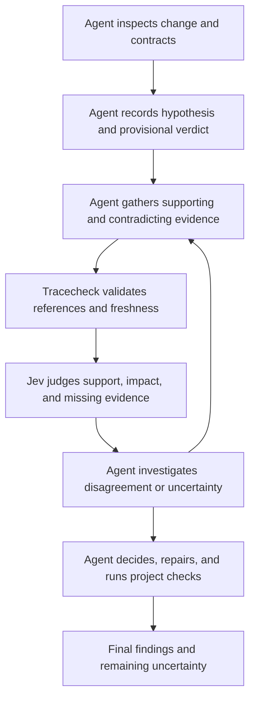

<div align="center">

# Tracecheck

**Independent evidence checks for coding agents, powered by Jev.**

Your agent investigates the code. Tracecheck checks its hypotheses against the evidence.

[](https://typesafe.ai)
[](#mcp-and-agent-setup)
[](package.json)

[Quick start](#quick-start) · [How it works](#how-it-works) · [Agent setup](#mcp-and-agent-setup) · [Quality dimensions](#quality-dimensions) · [Distribution](#distribution) · [Roadmap](#roadmap)

</div>

Tracecheck helps your coding agent challenge suspected defects against source evidence. The agent discovers concerns, follows callers, checks contracts and counterevidence, and decides what to fix. Tracecheck validates references and asks Jev for typed support, impact, and missing-evidence judgments. Optional broad assessments cover 19 quality dimensions and local checkpoint comparisons.

Run it as a **local MCP server** or use the **CLI** directly. Live assessments send code context, using your API key, to the configured provider: TypeSafe or OpenRouter. Tracecheck has no hosted application backend and does not edit or execute the code being reviewed.

> **Status:** Version 0.4.0 is the current release. This README describes the `main` branch. Changes listed under *Unreleased* in the [changelog](CHANGELOG.md) ship in the next release, and this README marks the options and settings they add as "Not in 0.4.0". Real-project accuracy calibration, broader source checks, and executable fix verification are in progress or planned. See [validation evidence](docs/validation.md) for what has actually been tested.

## What you get

| Capability | What it provides |
| --- | --- |
| **19 independent quality dimensions** | Separate relevance and evidence sufficiency, 1–10 scores, confidence, selected concerns, and suggested next steps. No blended overall grade. |
| **Agent-selected hypothesis verification** | Any language; exact source quotes, optional local-file validation, and independent support/impact judgments. |
| **Repository context** | Git changes and baseline source, bounded JS/TS and Python import discovery, callers, and related tests. |
| **Checkpoint comparisons** | Eligible quality deltas and finding history, without treating a missing finding as a verified fix. |
| **Explicit uncertainty** | Missing context, uncertain judgments, and omitted files remain visible. |
| **Agent and CLI workflows** | Four MCP tools, a continuous-review skill, readable terminal output, and JSON reports. |
| **Bounded requests** | Context budgets, provider deadlines and retries, usage accounting, and a short-lived MCP review cache. |

## Why Jev

[Jev](https://typesafe.ai) specializes in focused, typed judgments. Tracecheck uses its three [question primitives](https://docs.typesafe.ai/primitives) to turn a review into decisions that code can validate and compare:

| Primitive | Used for |
| --- | --- |
| **Noul** | Whether a quality dimension is relevant and sufficiently supported by the available context. |
| **Score** | An ordered quality assessment, normalized to a 1–10 scale. |
| **Choice** | Selecting a concern or classifying a source finding's support and potential impact. |

Independent questions can share a request and its source context. Tracecheck shares broad and source-check questions when the serialized request fits; otherwise it reduces candidate batches or splits independent broad questions without dropping source evidence. All requests are size-checked before inference begins. Empty evidence triggers no provider request. Typed responses support schema validation, explicit uncertainty, and automated comparisons without parsing a review essay.

The division of work is deliberate: code extracts locations and computes comparisons; Jev supplies semantic judgments; the coding agent decides how to improve the implementation. Jev does not generate patches or prove that a fix works. Its [confidence signals](https://docs.typesafe.ai/confidence) still need calibration against representative review cases.

## Quick start

### Requirements

- **Node.js 22.18 or later 22.x, or 24.11 or newer**, and npm.
- A Jev API key from the [TypeSafe console](https://console.typesafe.ai) for live assessments.
- Git and a repository with at least one commit for automatic collection. Supplied-context assessment does not require Git.

### Install

Version 0.4.0 is published to npm as `@bmccarn/tracecheck` and to the `bmccarn/tracecheck-plugins` plugin marketplace. Choose one of these installation paths. Each one needs a provider key in the environment that launches Tracecheck; see [set a provider key](#set-a-provider-key).

#### Install the agent plugin

The plugin installs the review skill and registers the four-tool MCP server.

**Claude Code**

```text
/plugin marketplace add bmccarn/tracecheck-plugins
/plugin install tracecheck@tracecheck-plugins
```

Invoke `/tracecheck:tracecheck` to start the review workflow.

**Codex**

```sh
codex plugin marketplace add bmccarn/tracecheck-plugins
codex plugin add tracecheck@tracecheck-plugins
```

Start a new task and ask to use the Tracecheck skill.

You can also add `bmccarn/tracecheck` itself as a marketplace. Its in-repo catalogs pin the latest stable release tag, currently `v0.4.0`, and never a release candidate. If you added this marketplace while its catalogs pinned `v0.2.0`, refresh the marketplace and update or reinstall the plugin to get 0.4.0.

#### Run the CLI from npm

```sh
npx --yes @bmccarn/tracecheck@0.4.0 --help
```

The package contains the bundled runtime and the complete skill directory, `skills/tracecheck/`. Installing it registers neither the MCP server nor the skill with any client. To connect another MCP client, follow [MCP and agent setup](#mcp-and-agent-setup).

#### Build from source

Build a checkout to use changes on `main` that are not in 0.4.0:

```sh
git clone https://github.com/bmccarn/tracecheck.git
cd tracecheck
npm ci
npm run build
```

The built `dist/plugin.mjs` includes its runtime dependencies and runs without `node_modules`.

### Set a provider key

```sh
# Set one of these in the environment that launches Tracecheck.
export TYPESAFE_API_KEY="your-key"
# JEV_API_KEY is also supported and takes precedence if both are set.
# Without a TypeSafe key, an OpenRouter key routes requests through OpenRouter.
# export OPENROUTER_API_KEY="your-openrouter-key"
```

### Run a first review

The examples in this README run the source checkout's `node dist/plugin.mjs`. With the npm package, run `npx --yes @bmccarn/tracecheck@0.4.0` in its place.

Try the scripted example without an API call. It runs from a source checkout:

```sh
npm run demo
```

This demo uses simulated decisions to illustrate source-finding output. For a real assessment, review a repository containing changes:

```sh
# Inspect the files and coverage gaps locally. No API key needed.
node dist/plugin.mjs preview --repo /path/to/repo \
  --task 'Return null for invalid JSON while preserving valid-input behavior'

# Send the collected context to Jev and save the report.
node dist/plugin.mjs review --repo /path/to/repo \
  --task 'Return null for invalid JSON while preserving valid-input behavior' \
  --out .tracecheck/before.json
```

Paths to the runtime above are relative to the Tracecheck checkout. `--repo` selects the repository being reviewed; report paths are relative to your current directory.

Collection compares **the base with the working tree**. The base is HEAD unless you pass `--base REF`. Tracked changes appear whether or not they are staged, but collection does not read the index: a change that is staged and then undone in the working tree is not reviewed, although a commit would include it. Use `--include-untracked` to include supported new files. Already committed changes need an earlier baseline to appear in the review.

Preview and review add a note naming each file whose staged change the working tree undoes, and each staged rename whose working-tree file differs too much from its source for Git to pair them. Such a rename is reviewed as a deleted file and a new file without a baseline. To review exactly what you are about to commit, make the working tree match the index first, for example with `git stash --keep-index`.

The working tree is compared with the merge base of `--base` and HEAD, the commit where HEAD's history left REF. When REF is HEAD or one of its ancestors, that is REF itself. When REF is a branch that has moved on, such as `origin/main` after other pull requests merged, its newer commits are left out, so they are not reported as your changes; a note says so. Preview and review report the requested ref as `baseRef` and the compared commit as `base`, and human output prints `Base: <commit> (from <ref>)`. 0.3.0 compared with the tip of REF.

## How it works



1. **Investigate as the agent.** Discover concrete concerns, record a provisional verdict, and gather relevant implementation, contracts, callers, tests, and counterevidence.
2. **Verify a hypothesis.** Use `tracecheck_verify` with exact source excerpts and original line references. Optional local source validation rejects stale or fabricated excerpts. Jev returns an independent judgment, not a patch or proof.
3. **Optionally assess broader quality.** The broad layer considers all 19 dimensions. The source layer evaluates specific parser-derived hypotheses where supported.
4. **Validate and qualify the result.** Responses are checked against their expected types. Scores and findings retain confidence, applicability, and coverage limitations.
5. **Compare locally.** Previous assessments are used for comparison, not sent to Jev as evidence about the current implementation.
6. **Investigate disagreement and act.** Investigate findings, make justified changes, run normal project checks, and review another checkpoint. Avoid changing code solely to raise a score.

For MCP repository reviews, preview produces a snapshot token. Review recollects the context and rejects a mismatched token if code, requirements, or supplied context changed. Repository reviews also recollect after inference. MCP review rejects evidence that changed during the request; CLI `review` prints the report with a `Stale report: ...` limitation and exits `4`, so the provider results are not lost. Untracked files outside the review, such as editor swap files or test output, never invalidate a snapshot. CLI `review` collects its own current context and does not require a prior preview token.

MCP preview tokens belong to the current server process and expire after five minutes or bounded-cache eviction. Repeat preview if the token is unavailable. A time-limited preview pins its completed discovery scope for review and freshness checks, so a faster warm scan cannot masquerade as a repository edit.

## Quality dimensions

These 15 dimensions are considered whenever the supplied evidence permits:

| Dimension | Focus |
| --- | --- |
| Correctness | Requirements, edge cases, invariants, and regressions. |
| Cognitive complexity | Control flow, state, and unnecessary indirection. |
| Readability | Names, intent, expression clarity, and explanation. |
| Modularity | Cohesive responsibilities and useful boundaries. |
| Coupling | Dependency direction, hidden inputs, and exposed internals. |
| Changeability | Scattered decisions and cascading edits. |
| Abstraction and API design | Useful interfaces and appropriate generality. |
| Project structure | Discoverability and placement of related behavior. |
| Duplication and reuse | Repeated knowledge and appropriate sharing. |
| Maintainability | Effort to understand, diagnose, and modify code. |
| Testability and test quality | Meaningful assertions, regression protection, and repeatability. |
| Reliability | Failure handling, cleanup, retries, and concurrency. |
| Security | Relevant trust boundaries and exposure. |
| Consistency | Alignment with established project conventions. |
| Documentation | Contracts, usage, and non-obvious decisions. |

Four additional dimensions depend on the problem's context:

| Dimension | Relevant evidence |
| --- | --- |
| Performance | Workload characteristics and cost-sensitive paths. |
| Scalability | Growth requirements and scaling constraints. |
| Compatibility | Existing consumers and compatibility contracts. |
| Observability | Operational needs and diagnostic behavior. |

Insufficient evidence can leave a dimension unscored; uncertainty is not a failing grade. Each dimension has a selected concern, and up to five actionable concerns are prioritized. A high score does not hide an independently actionable concern. These broad signals are distinct from findings with exact source locations.

## Review workflows

### Verify a specific concern

The primary agent workflow is documented with a complete JSON example in [tool usage](skills/tracecheck/references/tool-usage.md#focused-hypothesis-verification-primary-path). Save the agent-selected hypothesis, contract, evidence, and target quote in `evidence.json`, then run:

```sh
node dist/plugin.mjs verify --input evidence.json --repo /path/to/project \
  --out .tracecheck/verification.json
```

The agent chooses what to investigate. Tracecheck checks exact quotes and original line ranges, optionally matches excerpts to local files before and after inference, and returns a typed decision. When a repository is bound, an evidence file that is missing, a directory, a symlink, outside the repository, unreadable, or over 256,000 bytes stops verification before inference; the error names the evidence ID and its repository-relative path. `--repo` and the MCP `repo` argument name a directory in a Git working tree, and evidence paths are relative to that directory. A path that does not exist or is outside Git stops verification before inference with an error that names the path as given (0.3.0 showed the system error). Supplied-only evidence is explicitly labeled as such. Missing-evidence categories guide further investigation; they do not retrieve files automatically. Verification accepts any language without a parser rule.

### Compare implementation checkpoints

After addressing a concern, run another review with the same task and baseline:

```sh
node dist/plugin.mjs review --repo /path/to/repo \
  --task 'Return null for invalid JSON while preserving valid-input behavior' \
  --previous .tracecheck/before.json --out .tracecheck/after.json

# Compare source-finding identities separately from quality deltas.
node dist/plugin.mjs compare \
  --previous .tracecheck/before.json --current .tracecheck/after.json
```

Keep the baseline fixed across commits by passing the same commit SHA with `--base` to both reviews. Quality comparisons require matching scope, model, and rubric; uncertain pairs do not produce numeric improvement claims. Source history additionally checks repository, baseline, and policy compatibility.

A single-packet repository review returns `report.quality`. Larger changes return `report.packetQualities`, with the changed paths and assessment for each packet; these scores are not averaged into a repository-wide grade. `report.packetCount` counts every collected packet, including any whose review a failed request left incomplete. Previous-quality comparison is supported only for single-packet repository reviews; when a supplied previous evaluation cannot be compared, the report adds a note that says why. Source-finding history still uses the combined decisions.

`--previous` takes either a report saved by `review --out` or an evaluation saved by `assess --out`, for both `review` and `assess`. Tracecheck reads the quality evaluation from it: a report's `quality`, or the evaluation itself. A multi-packet report has no single quality evaluation, so it is rejected, as is any other file. The comparison still requires the same scope, model, and rubric version; a review and an assessment usually have different scopes, so they are reported as not comparable unless the assessment `scope` matches.

Source findings that were supported before can be `still_present`, `no_longer_supported`, `unresolved`, or `not_reassessed`. Findings supported only in the current report are `newly_supported`. None of these means a fix has been executed and verified.

A finding keeps its history when its file is renamed. A candidate ID includes the file path, so the finding gets a new ID at the new path. A decision on a renamed file records the file's path at the base as `previousPath`, and `compare` matches an earlier finding to that decision when both name the same base file, check, symbol, and quoted code, ignoring whitespace. The entry then adds `currentId` and `currentPath`. 0.3.0 reported such a finding as `not_reassessed` and again as `newly_supported`.

### Supply context directly

Use `assess` for focused snippets, remote code, non-Git work, or any language. Save this as `context.json`:

```json
{
  "task": "Return null for invalid JSON without changing valid-input behavior.",
  "files": [
    {
      "path": "src/decode.py",
      "content": "import json\n\ndef decode(value):\n    return json.loads(value)\n"
    }
  ],
  "repositoryContext": "The caller expects invalid JSON to produce None rather than an exception.",
  "scope": "example/decode"
}
```

```sh
node dist/plugin.mjs assess --input context.json --out quality-before.json

# After updating the supplied source:
node dist/plugin.mjs assess --input revised-context.json \
  --previous quality-before.json --out quality-after.json
```

A `diff` string is also supported. At least one current context field is required. Use a stable `scope` to identify the same review subject across checkpoints. `assess` evaluates only what you provide and performs no repository reads or parser-based source checks.

`assess` exits `0` whatever it finds. Add `--fail-on-priorities` to exit `1` when the evaluation lists quality priorities; a priority is a concern judged with confidence of at least 0.6 and probability of at least 0.8, so uncertain concerns do not fail the command.

### Upload findings to code scanning

`review --sarif FILE` writes the supported source-anchored findings as a [SARIF 2.1.0](https://docs.oasis-open.org/sarif/sarif/v2.1.0/sarif-v2.1.0.html) log, in addition to the normal output and exit code:

```sh
node dist/plugin.mjs review --repo . --base origin/main --sarif tracecheck.sarif
```

The review needs `origin/main` and the history back to the commit where the pull request left it. The default `actions/checkout` fetch is one commit deep and fetches only the checked-out ref, so it has neither. Fetch the full history:

```yaml
- uses: actions/checkout@v4
  with:
    fetch-depth: 0
- run: node dist/plugin.mjs review --repo . --base origin/main --sarif tracecheck.sarif
```

A smaller `fetch-depth` works when it reaches that commit, but a long-lived branch may need more than you expect. Without enough history, the review stops with exit `2` and an error that names the missing ref or says the clone is too shallow, rather than reviewing the wrong changes.

- Each check family that produced a decision (`zero-divisor`, `swallowed-failure`, `unhandled-json`) is a rule, with the check hypothesis as its description and the verification step as its help.
- Each `supported` decision is one result. Its location is the repository-relative path and line range, with the quoted source as the snippet; its message is the hypothesis. The level follows the judged impact: `high` is `error`, `medium` and `unknown` are `warning`, and `low` is `note`. Result properties carry `impact`, `impactConfidence`, `confidence`, `probability`, and `verification`.
- `uncertain`, `needs_context`, and `not_supported` decisions are not results. The run's `omittedDecisions` property counts them; the JSON report keeps them in full.
- Quality priorities have no source location and are not SARIF results. The run's `status` property still reflects them, and the exit code is unchanged.
- The run's `limitations` property lists coverage gaps and its `notes` property lists caveats that do not affect the status.

Paths are relative to the `SRCROOT` base, which the log maps to the reviewed repository root. The file holds source excerpts and is written with owner-only permissions.

### CLI options and exit codes

| Option | Purpose |
| --- | --- |
| `--repo PATH` | Git repository to collect; preview and review default to the current directory. verify matches excerpts against it; mcp uses it when a tool call names no repository. |
| `--base REF` | Git ref to review changes against; defaults to `HEAD`. The working tree is compared with the merge base of REF and HEAD (0.3.0 compared with REF itself). |
| `--include-untracked` | Include supported, non-ignored untracked files. `--no-include-untracked` states the default explicitly. |
| `--task TEXT` | Requested behavior or acceptance criteria. |
| `--context TEXT` | Relevant repository facts, contracts, or observed test results. |
| `--json` | Emit full JSON for preview, review, or assess. |
| `--out FILE` | Save a review report, verification result, or quality assessment as JSON. |
| `--sarif FILE` | Also write review's supported findings as SARIF 2.1.0. |
| `--previous FILE` | For review and assess, a report saved by `review --out` or an evaluation saved by `assess --out` to compare quality with. For compare, the earlier report. |
| `--current FILE` | For compare, the later report. |
| `--input FILE` | Evidence JSON for verify; context JSON for assess. |
| `--fail-on-priorities` | Make assess exit `1` when the evaluation lists actionable quality priorities. |
| `--index-max-files N` | Optional local import-index file budget; unset by default. |
| `--index-max-bytes N` | Optional local import-index byte budget; unset by default. |
| `--index-timeout-ms N` | Soft discovery deadline; defaults to 20,000 ms and reports partial coverage. |
| `--collection-timeout-ms N` | Collection deadline; defaults to 120,000 ms. |
| `--review-timeout-ms N` | Review deadline; defaults to 300,000 ms. |
| `--max-requests N` | Most provider requests one review may make; defaults to 50. |
| `-q`, `--quiet` | Do not print review progress to stderr. |

`preview` and `review` also read defaults for most of these options from the repository's [configuration file](#project-configuration-file). A flag always overrides the file.

`preview` estimates the review's cost: the human output prints `Review estimate: N provider request(s) carrying B bytes of evidence and questions`, and `preview --json` and `tracecheck_preview` return `estimate.requests` and `estimate.inputBytes`. The estimate comes from the same planner that review uses, so a completed review's `usage.requests` equals `estimate.requests`; retries after a failed request are not counted. `review` refuses a plan with more requests than the budget, exiting `2` with `Review would make N provider requests, over the budget of M` before it sends any request. Raise the budget with `--max-requests N` or the MCP `maxRequests` argument.

While `review` runs, it prints one progress line per step to stderr: each collection phase, the number of provider requests planned, each finished request (`Tracecheck progress: Completed provider request 3 of 7`), and the final check that the repository did not change. Stdout, `--json`, `--out`, and `--sarif` output are the same as with `--quiet`.

Commands take no positional arguments after the command name, so `review src/foo.ts` exits `2` with the command's usage instead of reviewing every change. Before `review`, `verify`, or `assess` collects from the repository or calls the provider, it checks that the `--out` and `--sarif` destinations can be written, reads and validates its input files, and checks for a provider key. It prints the result before it writes those files, so if a write still fails, the result is on stdout and the command exits `2`. An input file error names the flag, the file as you typed it, and each invalid field, for example `--input evidence.json is not valid verify evidence:` followed by `evidence[0].startLine: Invalid input: expected number, received string`.

Exit codes:

| Code | Meaning |
| --- | --- |
| `0` | Success. `review` and `verify` found no actionable concern in the checks performed, with no coverage gaps. A working tree with no changes also exits `0` and says there is nothing to review. |
| `1` | `review`: supported source findings or quality priorities. `verify`: the hypothesis is supported. `assess --fail-on-priorities`: actionable quality priorities. |
| `2` | Execution or input error. |
| `3` | `review` or `verify` is inconclusive because of uncertainty, coverage gaps, or a provider request that failed after its retries. |
| `4` | `review`: the reviewed files changed while the review ran. The report is still printed and saved, with a `Stale report: ...` limitation; run the review again. |
| `130` | Interrupted with Ctrl-C (SIGINT). The command stops its collection and provider requests and prints `Tracecheck: interrupted.` |

A report separates `limitations`, the coverage gaps that keep a review from exit `0`, from `notes`, caveats that never change the status: heuristic import discovery, the number of excluded untracked files, packets covered only by the broad quality review, and a previous evaluation that could not be compared. Markdown output lists them under **Notes** and **Coverage gaps**, except `Review incomplete for packet ...` limitations, which appear near the top under **Incomplete review**.

A zero exit does not prove correctness. Without `--fail-on-priorities`, `assess` exits `0` on any result. `--help` lists every flag for each command.

## MCP and agent setup

Tracecheck uses the **MCP v2 SDK over stdio** and exposes four tools:

| Tool | Input and behavior |
| --- | --- |
| `tracecheck_verify` | Verify an agent-selected hypothesis, contract, and source evidence; return uncertainty and a missing-evidence category. |
| `tracecheck_preview` | Collect a repository locally and return its manifest, limitations, notes, candidate count, request estimate, and snapshot token. |
| `tracecheck_review` | Review that snapshot with Jev; optionally compare a supplied `previousEvaluation`. Refuses a review over its `maxRequests` budget (default 50) before any provider request. |
| `tracecheck_assess` | Assess caller-supplied context in any language, with optional previous-evaluation comparison. Times out after 90 seconds. |

When a `tracecheck_review` call carries a progress token, the server sends `notifications/progress` for each collection phase and for each provider request as it finishes, whether it succeeded or failed. Progress never decreases. Once the review has planned its requests, each notification carries a `total`, and the last one reaches it. A cached result sends only the collection phases. A call that joins an identical review already running receives that review's progress, including the updates sent before it joined. A client that resets its request timeout on progress can wait out a long review.

Configure your MCP client with one of these launch commands:

| Setting | npm package | Source checkout |
| --- | --- | --- |
| Command | `npx` | `node` |
| Arguments | `--yes`, `@bmccarn/tracecheck@0.4.0`, `mcp` | `/absolute/path/to/tracecheck/dist/plugin.mjs`, `mcp` |

Forward `TYPESAFE_API_KEY` or `JEV_API_KEY`, and optionally `JEV_MODEL`, to the server. The server also reads `OPENROUTER_API_KEY`, `TYPESAFE_BASE_URL`, `JEV_TIMEOUT_MS`, and `JEV_CONCURRENCY`; 0.3.0 does not.

Append `--repo`, `/absolute/path/to/reviewed/repo` to bind the server to one repository. Otherwise, collection-tool calls must provide `repo`. A bound server accepts a `repo` argument that names its repository or any directory in it (0.3.0 accepted only the exact path) and rejects any other repository, including one nested inside it. GUI applications may not inherit variables exported in `.zshrc`; use your client's environment configuration.

The package includes portable plugin manifests, client compatibility adapters, and a [continuous-review skill](skills/tracecheck/SKILL.md). The skill supplies the review cadence; the MCP server alone only exposes its tools. For a client without a plugin marketplace, load the complete `skills/tracecheck/` directory, not only `SKILL.md`, through the client's skill support. The [Cursor setup](docs/integrations.md#cursor-manual-mcp--skill) shows both steps.

A useful first instruction to your agent:

> Use Tracecheck after meaningful implementation checkpoints. Investigate the code, identify concrete concerns, and collect supporting and contradicting evidence. Verify each material hypothesis, investigate disagreements, and run the project's checks. Report your final judgment and remaining uncertainty.

MCP protocol and packaging have been validated; installation in every native client has not. The standalone bundle needs Node.js, but no separate runtime dependency installation.

## Distribution

One release publishes the same bundled runtime and skill through three channels:

| Channel | Contents |
| --- | --- |
| npm `@bmccarn/tracecheck` | Stable releases under the `latest` tag and release candidates under `next`, published with provenance. |
| [GitHub releases](https://github.com/bmccarn/tracecheck/releases) | The npm tarball and the marketplace archive for each release tag. |
| `bmccarn/tracecheck-plugins` | The generated plugin marketplace. Only stable releases update it. |

To build and check both archives locally, run:

```sh
npm run package:check
```

This builds and verifies an npm tarball and a marketplace bundle in `release/`. The packaged CLI and MCP handshake are tested through offline `npm exec`, outside the checkout.

The `0.2.0` npm package and [v0.2.0 release artifacts](https://github.com/bmccarn/tracecheck/releases/tag/v0.2.0) remain available. `0.2.0` predates the four-tool MCP server and the matching skill, so do not pair it with the current skill.

The [publishing guide](docs/publishing.md) covers release-candidate testing, stable publication, and recovery.

## Configuration and data handling

| Environment variable | Default | Purpose |
| --- | --- | --- |
| `TYPESAFE_API_KEY` | Required unless `JEV_API_KEY` or `OPENROUTER_API_KEY` is set | TypeSafe authentication. |
| `JEV_API_KEY` | Unset | Alternative key name; takes precedence. |
| `OPENROUTER_API_KEY` | Unset | OpenRouter authentication. Used only when no TypeSafe key is set, and then requests go to OpenRouter. |
| `TYPESAFE_BASE_URL` | `https://api.typesafe.ai`, or `https://openrouter.ai/api` when only an OpenRouter key is set | Base URL of a System One API. Tracecheck appends `/v1/systemone`. It must use HTTPS unless the host is loopback, and it must not contain credentials, a query, or a fragment. |
| `JEV_MODEL` | `jev-latest` | Model selection. Use an available concrete version for repeatable evaluations. |
| `JEV_TIMEOUT_MS` | `45000` | Time limit for one Jev request, in milliseconds, including its retries. A whole number from 1 to 3,600,000. The overall review deadline still applies. |
| `JEV_CONCURRENCY` | `4` | Most review requests in flight at once. A whole number from 1 to 16. Lower it if the provider rate-limits your account. Reports do not depend on it. |

Tracecheck does not load `.env` files automatically or persist your API key. To keep keys in a file, pass the file to Node when you run a source checkout, for example `node --env-file=.env dist/plugin.mjs review --repo /path/to/repo`, and keep the file out of Git. Review requests are authenticated directly to the [TypeSafe API](https://docs.typesafe.ai/api), or to OpenRouter's System One API when it is configured. The selected source, baseline versions, dependencies, tests, and supplied task/context may leave your machine during live assessment. Local execution is not offline inference.

- `preview` is local. `preview --json` shows the captured source as well as the collection metadata.
- The collector skips generated paths, symlinks, binary files, and files that contain a potential credential. The same screening runs on every string in a provider request, including supplied task, diff, file, and context text. It detects private key blocks (including PGP, DSA, and encrypted keys), common provider token formats (AWS, GitHub, OpenAI-style, Slack, Google, Stripe, npm), passwords in URLs, and credential-named assignments (`password`, `token`, `secret`, `api_key`, and similar) whose quoted or unquoted value looks random. Values that read as identifiers, such as `'StringLiteralToken'`, and references such as `${API_TOKEN}` are not flagged. A skipped file is named in the collection limitations, and a blocked request names the file path or input field. Neither message includes the matched value. This is not comprehensive secret detection.
- Saved reports contain code excerpts and repository metadata. Treat them as source-bearing artifacts. This checkout ignores `.tracecheck/` and `.env` files.
- Repository review results are cached in the MCP process for up to five minutes, with at most 16 entries. Cache hits retain the original timestamp and include an explicit cache flag. Prior assessments are compared locally without repeating inference. This cache does not apply to CLI runs or supplied-context assessments.
- Identical `tracecheck_review` calls made while a review is running wait for that review instead of calling the provider again, and all but the first report `cached: true`. A call that is cancelled or times out stops waiting and fails on its own. The review stops only when every call waiting for it has stopped, so a retry after the only waiting call was cancelled starts a new review.

### Project configuration file

To avoid repeating flags, commit a `.tracecheck.json` file at the repository root. CLI `preview` and `review`, and the MCP `tracecheck_preview` and `tracecheck_review` tools, read it from the repository they collect. An MCP server launched with `--repo` reads that repository's file. `verify` and `assess` do not read it. Every key is optional:

```json
{
  "task": "Keep the public API backward compatible.",
  "repositoryContext": "Tests run with node:test; the CLI bundle is committed.",
  "collection": { "maxIndexFiles": 5000, "indexTimeoutMs": 15000, "collectionTimeoutMs": 60000 },
  "reviewTimeoutMs": 120000,
  "model": "jev-latest",
  "requestTimeoutMs": 30000,
  "requestConcurrency": 2,
  "maxRequests": 20
}
```

| Key | Same as | Largest value the file may set |
| --- | --- | --- |
| `task`, `repositoryContext` | `--task`, `--context`, and the MCP arguments of the same names | Any; shown in the output as coming from the file |
| `collection` | `--index-max-files`, `--index-max-bytes`, `--index-timeout-ms`, `--collection-timeout-ms` as `maxIndexFiles`, `maxIndexBytes`, `indexTimeoutMs`, `collectionTimeoutMs`, and the MCP `collection` argument | `indexTimeoutMs` 20,000 and `collectionTimeoutMs` 120,000; the index budgets have no default, so any value lowers them |
| `reviewTimeoutMs` | `--review-timeout-ms` and the MCP `reviewTimeoutMs` argument | 300,000 |
| `model` | `JEV_MODEL` | Any |
| `requestTimeoutMs` | `JEV_TIMEOUT_MS` | 45,000 |
| `requestConcurrency` | `JEV_CONCURRENCY` | 4 |
| `maxRequests` | `--max-requests` and the MCP `maxRequests` argument | 50 |
| `base`, `includeUntracked` | `--base`, `--include-untracked`, and the MCP arguments of the same names | Only the defaults, `"HEAD"` and `false` |

#### Trust model

The file is repository content: anyone who can commit to the repository controls it, while your machine and your provider key pay for the review. Tracecheck therefore treats it as untrusted.

- It may restate or lower a default, never go beyond one. It cannot include your untracked files, move the baseline to an older commit, or raise a timeout, the request concurrency, or the request budget. A file that tries is rejected with an error naming each such key and the flag, MCP argument, or environment variable that can raise it; Tracecheck does not silently ignore it. Those settings belong to whoever runs the review.
- A task or repository context from the file is shown to you. Preview and review print it as `Task from the repository settings file .tracecheck.json: ...` or `Repository context from the repository settings file .tracecheck.json: ...`, in human and JSON output and over MCP, so you can see what the model was told. `--task` or `--context` replaces it.
- It cannot hold credentials or name the provider endpoint, so it cannot redirect your key.

Each setting resolves in this order:

1. A CLI flag or MCP argument. Collection limits resolve per key, so `--index-max-files` keeps the file's `indexTimeoutMs`.
2. An environment variable. Only `model`, `requestTimeoutMs`, and `requestConcurrency` have one: `JEV_MODEL`, `JEV_TIMEOUT_MS`, and `JEV_CONCURRENCY`.
3. The configuration file.
4. The built-in default.

The file is validated with the same schemas as the flags and MCP arguments. An unknown key, an invalid value, a symlinked or oversized file, or invalid JSON stops the command with an error that names the key but never quotes its value. The file cannot hold credentials: a field whose name contains the word key, token, secret, or password is rejected, and so is a value that matches a known credential pattern. Words are matched whole or as camelCase segments, so `apiToken` is rejected as a credential field and `maxTokens` is reported as an unknown key. The provider endpoint is not configurable from the file either, so a repository cannot redirect your key. Set keys and `TYPESAFE_BASE_URL` in the environment.

The preview snapshot covers the file's validated content. Editing the file between `tracecheck_preview` and `tracecheck_review` makes the review reject the snapshot, so run the preview again. Formatting-only edits keep the snapshot. The human-readable `preview` output prints `Settings: .tracecheck.json` when the file was applied.

### Using Jev through OpenRouter

OpenRouter serves Jev through a [System One API](https://openrouter.ai/docs/guides/community/typesafe-sdk) that accepts TypeSafe's request format. Set `OPENROUTER_API_KEY` to use it. The setup from OpenRouter's TypeSafe SDK guide also works: set `TYPESAFE_API_KEY` to your OpenRouter key and `TYPESAFE_BASE_URL` to `https://openrouter.ai/api`.

`JEV_MODEL` takes the same bare IDs as TypeSafe, such as `jev-latest`, and OpenRouter routes them to its `typesafe/` models. Reports record the model ID that OpenRouter returns, for example `typesafe/jev-1.13-20260917`. OpenRouter bills these requests to your OpenRouter account, and review context passes through OpenRouter on its way to TypeSafe.

OpenRouter lists a 32,000-token context for Jev. When a request exceeds the provider's limit, Tracecheck gives the same "split the review" guidance it gives for TypeSafe.

### Collection limits

| Limit | Current value |
| --- | --- |
| Collected files per packet | 16 |
| Current file read limit | 256,000 bytes |
| Baseline file read limit | 8 MiB |
| Primary changed files per packet | Up to 8, with evidence capacity reserved for supporting context |
| Focused source per current/baseline version | Up to 12,000 characters each, reduced further if required to fit |
| Caller/import discovery | Eligible tracked JS/TS/Python files; optional file/byte caps and a soft deadline |
| Source context per packet, including baselines | 60,000 characters and 80,000 serialized bytes |
| Parser-derived source candidates | No global cutoff; evaluated in batches of up to 10 |
| Serialized review request | 160,000-byte preflight; provider client also enforces 180,000 bytes |

Every safely readable, supported changed file is assigned to a packet; later files are not dropped after the first eight. Large files use bounded excerpts with original line anchors, visible omissions, and full-content digests. This covers changed files, not necessarily every changed line: omitted ranges, unsupported files, secrets, and unreadable or oversized files remain coverage gaps.

Repository discovery is separate from model-input size. A bounded in-process cache retains file identities and import edges, not raw source, and rechecks paths, timestamps, inode/device identity, and the known file set before reuse. Each CLI process starts cold; repeated MCP requests and recollection within a CLI review can reuse the index. One-hop JS/TS and Python import discovery remains heuristic. JS/TS `paths` and `baseUrl` aliases resolve through the nearest `tsconfig.json` or `jsconfig.json` among the collected files, following `extends` only through relative paths inside the repository; package and external `extends` targets are reported, not read. Unresolved imports and dynamic behavior may be missing even when every eligible file was indexed.

Partial discovery reports successfully indexed versus eligible file counts and bounded omission summaries. Raise discovery deadlines for a large repository without increasing model packet sizes. CLI flags above correspond to MCP's nested `collection` fields `maxIndexFiles`, `maxIndexBytes`, `indexTimeoutMs`, and `collectionTimeoutMs`; use identical collection arguments for preview and review. MCP review accepts `reviewTimeoutMs` separately. Timeouts accept positive integer milliseconds up to one hour. More packets mean more provider requests; preview exposes packet membership before transmission.

## Security model

Tracecheck reads a repository. It never runs the repository's code, tests, or build. Two parts of a review still depend on what the checkout contains: the Git commands that collection runs, and the text that Tracecheck prints.

### Untrusted checkouts

Collection runs `git rev-parse`, `diff`, `ls-files`, `ls-tree`, and `cat-file` in the checkout, and Git reads the checkout's own `.git/config`, which can name commands for Git to run. Its diff commands pass `--no-ext-diff` and `--no-textconv`, so external diff and textconv drivers never run. Every Git command also sets `core.fsmonitor=false` and `core.hooksPath=/dev/null`, so a file system monitor or a hook, such as `post-index-change` when `git diff` refreshes the index, does not run either. The same settings reach the Git commands that check submodules.

Clean filters still run. To compare a working-tree file with the baseline, `git diff` passes it through the filter that `.gitattributes` or `.git/info/attributes` selects, through `filter.<driver>.clean` or `filter.<driver>.process`, as `git status` does. This happens for each changed file and for each file whose timestamps no longer match the index. Tracecheck cannot turn filters off without changing the comparison: files stored through a filter, such as Git LFS or git-crypt files, would no longer match their stored form and would appear changed.

A fresh clone is not exposed to this. `git clone` does not copy `.git/config`, `.git/info/attributes`, or hooks, so the only filter commands that can run are the ones your own global or system Git configuration defines. A checkout that arrives as a directory or an archive, or one that another user can write to, keeps its `.git` directory. Reviewing it is as risky as running `git status` in it. Check `git config --list --show-origin` for `filter.` entries that come from the checkout before you review it, or review a fresh clone instead.

### Terminal output

Human-readable output prints control characters from file paths, source excerpts, provider responses, and error messages as visible escapes such as `\x1b`. A reviewed file therefore cannot send terminal escape sequences that clear the screen, set the window title, or write to the clipboard. Source excerpts keep tabs and line breaks. Markdown output also backslash-escapes Markdown-significant characters in the text it quotes, such as paths, symbols, and coverage gaps. JSON and SARIF output keep the original strings, so a program that prints their fields to a terminal must escape them itself.

## Coverage and validation

The broad assessment accepts code in any language, but that is not a claim of equal accuracy across languages. Automatic collection supports common source, configuration, and documentation extensions. Exact parser-derived findings currently cover **JS/TS division or remainder boundaries, swallowed failures, and JSON parsing boundaries**. A matching syntax pattern is a hypothesis for Jev to assess, not an automatic bug report.

```sh
npm run check                       # Type checks source, tests, examples, and benchmarks; emits nothing
npm run build                       # Bundles dist/plugin.mjs
npm run validate                    # Type checks, bundles, and tests
npm run package:check               # Bundles, then checks tarball contents and offline CLI/MCP execution
npm run release:check               # validate, package checks, and release metadata; type checks and bundles once
npm run demo                        # Scripted example; no live inference
npm run journey                     # End-user journey on the packed package; stand-in provider, no key
npm run journey -- --provider live   # The same journey against the configured provider
npm run benchmark -- --live          # Six synthetic source-check cases
npm run smoke -- --live              # Live MCP review and cache verification
npm run quality-smoke -- --live      # Live supplied-context Python assessments
npm run accuracy -- --repo /path/to/rapidregs-ingest # Offline real-project label checks; maintainers only
npm run calibrate -- run            # Offline check of the labeled gate-calibration cases
npm run calibrate -- run --live     # Live gate calibration; about 216 requests
```

Live commands require credentials and consume API usage. The accuracy benchmark measures a repository that is not publicly available, so only maintainers can run it; see [the accuracy benchmark](docs/accuracy.md). The [decision-gate calibration](docs/calibration.md) measures the source-check and quality gates on labeled synthetic pairs and compares candidate thresholds for a maintainer decision. The [validation record](docs/validation.md) documents automated checks, observed live results, and their limits. The small synthetic benchmark is a smoke test, not a general accuracy estimate. Tracecheck does not currently run tests, reproduce failures, or verify fixes by execution.

GitHub Actions runs CI on every pull request and on every push to `main`. The workflow tests on Node 22.18.0, the oldest supported 22.x release, and on the latest Node 24.x release. Each run checks that the committed `dist/plugin.mjs` matches a fresh build (`node scripts/build.mjs --check`), runs the offline demo and the end-user journey, and runs `npm run release:check`. A new push to a pull request cancels that pull request's earlier run. The checks need no provider credentials. Commit the rebuilt bundle with any change that affects it.

## Troubleshooting

| Symptom | What to check |
| --- | --- |
| Missing API key | Export a supported variable in the launching process. For GUI clients, configure its environment explicitly. `preview` and `compare` work without a key. |
| No changed files | The default baseline is `HEAD`. Select an earlier commit for committed changes; opt in to untracked files when needed. |
| `Base ... was not found` or `this is a shallow clone` | The ref is misspelled or was never fetched, or the clone's history stops before the merge base. Fetch the ref, for example `git fetch origin main`, or fetch the full history with `git fetch --unshallow` or `fetch-depth: 0` on `actions/checkout`. |
| Snapshot mismatch | Preview again and use the same repository, baseline, task, and context for review. |
| Missing scores or inconclusive result | Read applicability and coverage limitations. Provide the missing contracts, callers, or tests rather than treating uncertainty as a defect. |
| Comparison skipped or rejected | Keep scope, baseline, model, and rubric/policies consistent; use the correct report type for the command. |
| Context limit error | Narrow the diff or supplied files and remove unrelated context. |
| `Review incomplete for packet ...` limitation | A provider request failed after its retries. The report keeps every other result and names the source checks and broad review that were not evaluated. Run the review again; MCP does not cache incomplete reports. If the provider is rate-limiting, lower `JEV_CONCURRENCY`. |

## Roadmap

Version 0.4.0 added OpenRouter as a provider, SARIF output, a request budget with a preview estimate, concurrent review requests, and the `.tracecheck.json` project settings file. It also recalibrated the decision gates against the live model. It is the current release; 0.3.0 was the previous one.

The [accuracy baseline](docs/accuracy.md) reports the tradeoffs: smaller fixture packets cut input tokens by 51.9% but lowered defect recall. The agent-first workflow adds focused hypothesis verification and a [paired evaluation protocol](docs/agent-evaluation.md). Next steps are fresh agent-only versus assisted trials, better evidence selection through the skill, and calibration on independent bug/fix families.

Later work includes broader source checks, incremental reassessment, and isolated reproductions with fix verification. These are planned capabilities, not current features.

## Development

Run `npm ci`, `npm run validate`, and `npm run journey` before submitting implementation changes. The journey installs the packed package and drives every CLI command and MCP tool through a realistic project; see the [verification skill](.agents/skills/verify-tracecheck/SKILL.md). A useful bug report includes a minimal reproducible fixture, expected behavior, actual report, and relevant model/version information; remove credentials and private source first.

| Location | Purpose |
| --- | --- |
| [`src/collector.ts`](src/collector.ts) and [`src/checks.ts`](src/checks.ts) | Git context and parser-derived candidates. |
| [`src/jev.ts`](src/jev.ts) | Typed provider requests, validation, and retry handling. |
| [`src/quality.ts`](src/quality.ts) and [`src/quality/`](src/quality/) | Dimension assessment and quality comparisons. |
| [`src/review.ts`](src/review.ts) and [`src/history.ts`](src/history.ts) | Review orchestration, rendering, and source-finding history. |
| [`src/mcp.ts`](src/mcp.ts) and [`src/cli.ts`](src/cli.ts) | MCP tools and command-line entry points. |
| [`test/`](test/) and [`examples/`](examples/) | Regression tests, demos, and live smoke checks. |

Further reading: [Design](docs/design.md) · [Integrations](docs/integrations.md) · [Validation](docs/validation.md) · [Accuracy benchmark](docs/accuracy.md) · [Gate calibration](docs/calibration.md) · [Agent evaluation](docs/agent-evaluation.md) · [Capability coverage](docs/parity.md)

## License

[MIT](LICENSE).
